# MIT Maker Portfolio
# Wi-Fi Extender and Load-balancer
## Julius Putra Tanu Setiaji (Applicant ID 1819569)
Note: screenshots and pictures are only taken from the final revision of the system


### 1. Initial Problem: No Wi-Fi in my room

In my hostel, there is a Wi-Fi hotspot available for use in the common area of the floor, but it does not reach the rooms. There is also no Ethernet connection in the rooms, so in order to access the internet, hostel residents must go to the common area that has limited available space. Moreover, the common area is not enclosed with walls, thus it is windy and cannot be used during rain.

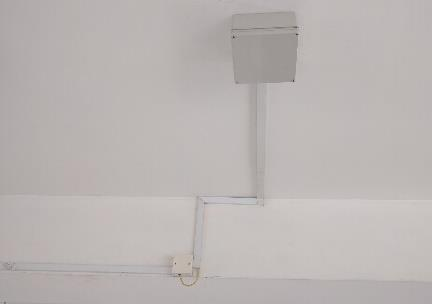

**Figure 1.1** The abovementioned Wi-Fi router enclosed in a metal box

### 2. Initial Solution: Use an off-the-shelf TP-Link Wi-Fi extender

I initially used an off-the-shelf TP-Link Wi-Fi extender. However, it does not have sufficient range (probably exacerbated by the fact that the hostel Wi-Fi is enclosed in a metal box). Signal-to-noise ratio (SNR) is especially high as this Wi-Fi extender has only one Wi-Fi transceiver, thus the rebroadcasted Wi-Fi signal is located on the same channel as the hostel Wi-Fi. The Wi-Fi extender also could only operate in half-duplex mode, further worsening bandwidth and reliability.

### 3. First Improvement: Use 2 routers and a pair of powerline adapters

After some time, having heard about powerline adapters previously, I devised a scheme to extend the hostel Wi-Fi into my room without the overhead usually associated with Wi-Fi extenders. I put one Wi-Fi router in the common area, connected to a powerline adapter, and in my room I connected another powerline adapter to a Wi-Fi router to allow devices in my room to connect to the internet (as shown in Figure 3.1). To do this, I needed to be able to reverse the usual role of Wi-Fi router as a base station (Ethernet  Wi-Fi) into a Wi-Fi receiver (Wi-Fi  Ethernet), thus I had to use custom firmware. In this case, I chose OpenWRT for its complete documentation, modularity and compatibility with a wide range of inexpensive TP-Link routers.

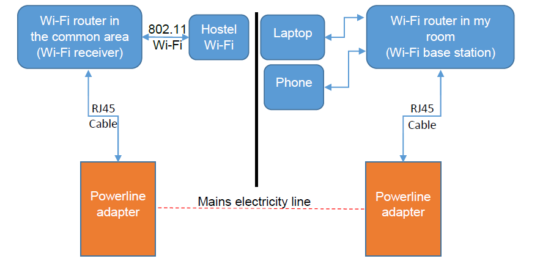

**Figure 3.1** Diagram on how the first improvement of my Wi-Fi extender worked

The difficult part on getting my first Wi-Fi extender to work was to find which power point to plug my powerline adapter into such that I could get a good speed. After several attempts, I finally purchased a 10m RJ45 cable and connected the powerline adapter to a power point in the common area nearest to my room as it offers the best speed (about 20 Mbps as compared to speeds as low as 1.5Mbps from some power points).

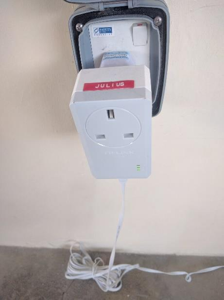

**Figure 3.2** Powerline adapter on the common area. I rolled the unused cable for tidiness


**Figure 3.3** I used sellotape (Scotch Tape) to stick the cable to the wall and make sure the cable is not a tripping hazard

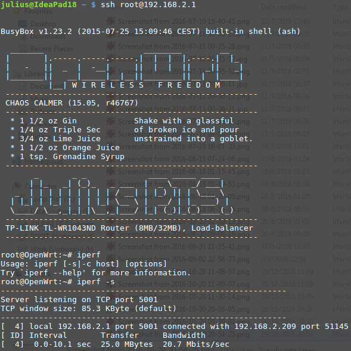

**Figure 3.4** Speed test result using iperf

Using LuCI (OpenWRT html-based web interface), I set the network up. In the Wi-Fi receiver in the common area, I connected to the Wi-Fi and masqueraded the Wi-Fi interface to the WAN Ethernet interface as shown in Figure 3.5. In the Wi-Fi base station in my room, I masqueraded the incoming WAN interface into the Wi-Fi interface (just like what the usual Wi-Fi routers do) as shown in Figure 3.6.

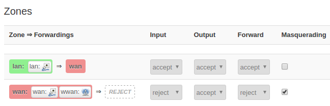

**Figure 3.5** LuCI configuration on the Wi-Fi receiver in the common area

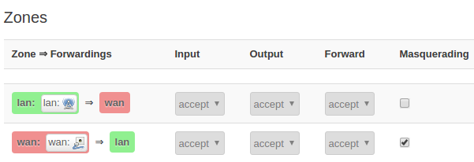

**Figure 3.6** LuCI configuration on the Wi-Fi router in my room

This system worked wonderfully and finally I was able to access the internet reliably in my room.

Before (Initial Solution)|After (First Improvement)
---|---
Unusable internet – more than 90% package loss|Reliable internet when used for light internet browsing or bandwidth-intensive services by 1 device only.

### 4. Second problem: Limited bandwidth and lowered reliability when used concurrently by multiple devices

I shared my internet with my roommate, and I started to feel the deficiency of this system: hostel Wi-Fi throttles bandwidth to 256 KB/s per device. This caused the internet connection in my room to slow to a crawl whenever both of us were using bandwidth-intensive services such as YouTube, since the hostel Wi-Fi router registered my Wi-Fi receiver in the common area as one device but actually in my room the Wi-Fi was simultaneously being used by up to 5 devices. Besides the slow speed, latency was high (up to 2000 ms) and many IP packages were lost (sometimes up to 60% package loss) due to the bandwidth throttling.

### 5. Second improvement: Use load-balancing to combine bandwidth from two Wi-Fi receivers

I then made another plan to increase the reliability and speed of my Wi-Fi extender. While browsing the OpenWRT website, I found a package called mwan3 which can load-balance connections through several interfaces on different subnets. I thought of using several routers, each connected to the hostel Wi-Fi, and then those routers would be connected to one router which acts as a load-balancer. The system works as shown in Figure 5.1.

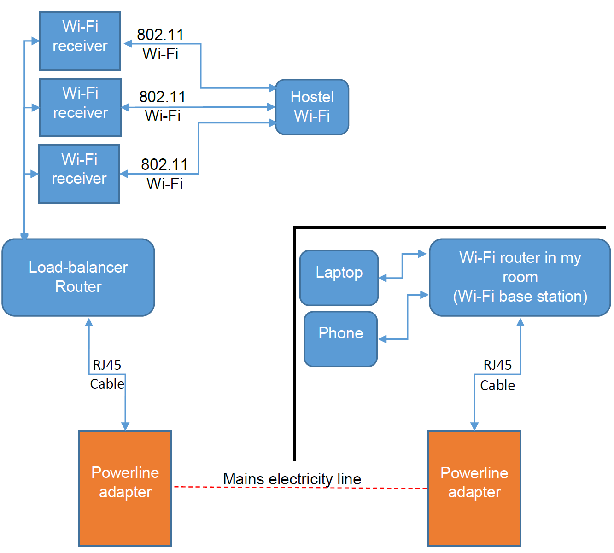

**Figure 5.1** Diagram of how second improvement of my system works

I bought a cheap router off Carousell (an online second-hand market in Singapore). I SSH’ed into my router and installed the mwan package using the opkg package manager. I then connected the new router to the load-balancer router and used mwan configuration as in Figure 5.2.

The system worked! One connection’s maximum speed is still 256 KB/s, but a maximum throughput of 512 KB/s can be achieved through multiple connections (such as the BitTorrent protocol or downloading using multiple streams through aria2). Reliability of the system also increased as now there are 2 Wi-Fi receivers that can communicate with the hostel Wi-Fi, so less traffic is dropped.

```
config interface 'wan'
option enabled '1'
config interface 'wan2'
option enabled '1'
config member 'wan_m1_w3'
option interface 'wan'
option metric '1'
option weight '3'
config member 'wan2_m2_w3'
option interface 'wan2'
option metric '2'
option weight '3'
config policy 'balanced'
list use_member 'wan_m1_w3'
list use_member 'wan2_m2_w3'
```

**Figure 5.2** mwan configuration file I used for 2 Wi-Fi receivers

Before (First Improvement)|After (Second Improvement)
---|---
Reliable internet when used for light internet browsing or bandwidth-intensive services by 1 device only.|Reliable internet even when used for bandwidth-intensive services by 2 devices
Maximum speed of 256 KB/s|Maximum speed of 512 KB/s
Under heavy bandwidth load, latency worsens to 2000 ms and package loss of up to 60%|Under heavy bandwidth load, latency worsens to 1000 ms and package loss of up to 30%

### 6. Third improvement: Adding more Wi-Fi receivers into the load-balancing system, and third problem: Soft-bricking a router, and solution: Go into failsafe mode

It was time to add new Wi-Fi receivers. The next problem that I had was when I purchased 2 cheap TP-Link routers which have only 4MB ROM instead of 8MB. The limited space means that if I flash the precompiled image, there will not able enough space for customisation. Further reading on the OpenWRT website led me to compile OpenWRT from the source code myself and choosing what kernel modules to include. I then purged all IPv6 related modules, and added USB and ext4 file system kernel modules as well as my favourite tools, such as screen, htop, iperf, etc. The resulting image would still result in insufficient space for customisation, but now I could put rootfs on a USB thumb drive, essentially putting all the customisation on the USB thumb drive.

For my first compiled image, I had inadvertently forgot to include dropbear (which provides SSH) and LuCI (which provides web-based controls). I was left with no way to access the router. I panicked and thought the router was unsalvageable (and was about to research on how to resuscitate the router through a serial port) when I found out about the built-in OpenWRT failsafe mode. I entered the failsafe mode, telnet into the router, and then using netcat pushed the new compiled image into the router and flashed it.

With everything working properly, I then bought 2 more routers off Carousell, so in total I now have 4 routers. The system is still expandable as there is still one more unused Ethernet port on the load-balancer router. Moreover, I can also use the other Wi-Fi routers as load-balancers as well, then adjust the weights (how likely a connection is routed through certain interfaces) accordingly on the load-balancer routers as shown in Figure 6.1. This can be done because each Wi-Fi receiver is also a router.

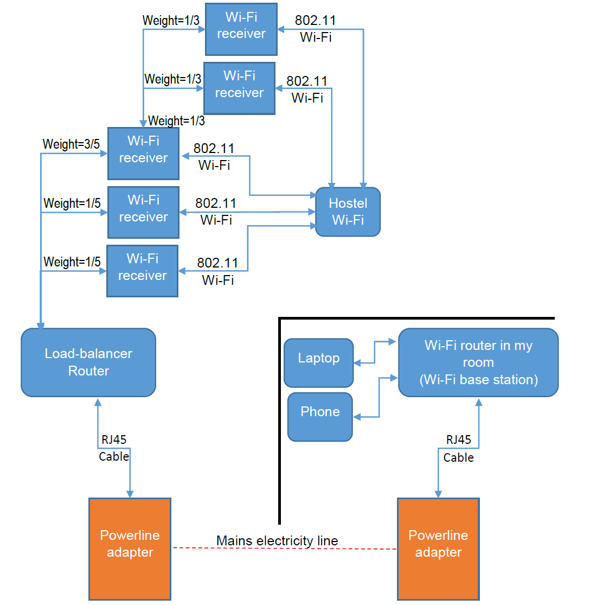

**Figure 6.1** Expandability of the system

The resulting maximum theoretical bandwidth to the internet is thus 1024 KB/s (Figure 6.2) – 256 KB/s multiplied by 4 routers. Moreover, I can achieve latency of around 100 ms (Figure 6.3), an improvement of almost 20 times the single-router configuration. I did a speed test using iperf to my DigitalOcean server to test the maximum throughput to the internet. Using one connection, I got 350 KB/s, but using 8 connections, I can get 974 KB/s (Figure 6.4).

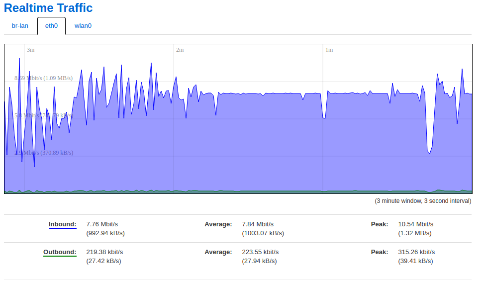

**Figure 6.2** Achieving close to theoretical maximum throughput of 1024KB/s

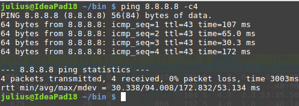

**Figure 6.3** Achieving latency of around 100 ms

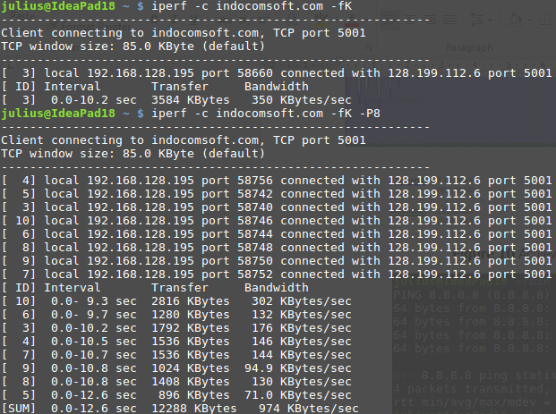

**Figure 6.4** A speed test using iperf to my DigitalOcean server, first with only 1 connection, and then using 8 connections

The current configuration of the device is shown in Figures 6.5 to 6.7. In total, I spent S$30 for the routers and RJ45 cables, and S$20 for the pair of powerline adapters, for a total of S$50 (~US$36) for a system that I will use for 12 months (around US$3/month) which is rather cheap.

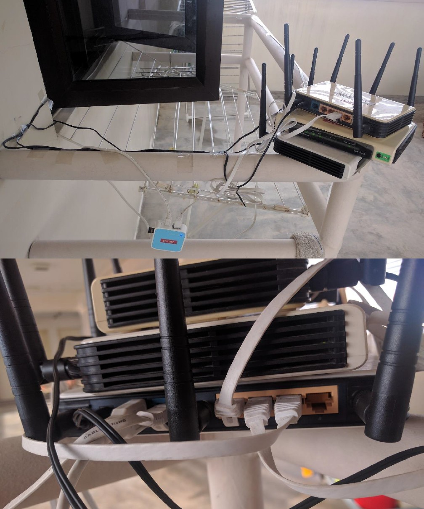

**Figure 6.5** A total of 4 routers are used in the common area, with one acting as load-balancer (the bottom router). Notice the one unused Ethernet port that can be used to expand the system. I used blu-tacks to stick the bottom router to the metal pole so that it will not fall down.

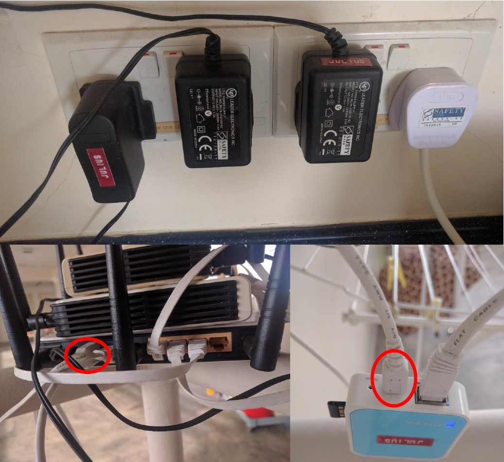

**Figure 6.6** The 3 black adapters are for my routers. So as not to use all power points available, to power my fourth router, I used a USB port from one router to power the mini-router through MicroUSB

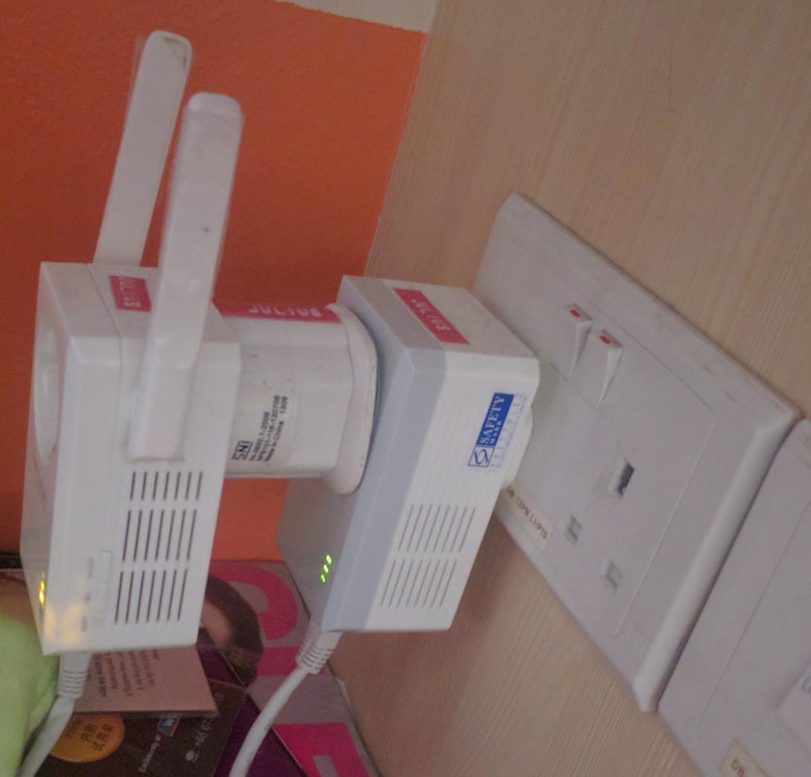

**Figure 6.7** The powerline adapter and Wi-Fi router in my room

Before (Second Improvement)|After (Third Improvement)
---|---
Reliable internet even when used for bandwidth-intensive services by 2 devices|Reliable internet when used by multiple devices (tested with 7 devices)
Maximum speed of 512 KB/s|Maximum speed of 1024 KB/s
Under heavy bandwidth load, latency worsens to 1000 ms and package loss of up to 30%|Even under heavy bandwidth load, latency is maintained between 100-200 ms, and package loss is below 5%

### 7. Fourth problem: Captive portal login and daily internet shutdown

The hostel Wi-Fi, however, implements a captive portal login which will expire after 30 minutes of inactivity. It also shuts down connection to internet every day from 1am to 5am, which makes the status of whether the routers are logged in a bit iffy. When the internet got back up at 5am, sometimes routers are logged out, sometimes the routers are still logged in.

### 8. Fourth improvement: Shell script to monitor status

Thus, I wrote a shell script to determine internet connectivity status which also doubles as a script to periodically send traffic so as not to be logged out automatically from the system. The script and the output are shown in Figures 8.1 to 8.3. Whenever I see that an interface is down, I can take action, such as by logging in to the captive portal login site. The script is run on the load-balancer router. The script also logs the time each interface goes up or down.

```bash
#!/bin/sh
#
#/etc/check.sh v1.1.20160910
#(c) 2016, Julius Putra Tanu Setiaji
#Check whether all four routers are working
#And periodically send traffic to prevent disconnection
e2="okay"
e3="okay"
w0="okay"
e4="okay"
while true; do
  e2i="$e2"
  e3i="$e3"
  w0i="$w0"
  e4i="$e4"
  echo $(date) Start checking...
  if ping 8.8.8.8 -w2 -c1 -Ieth0.2>/dev/null; then
    echo eth0.2 okay
    e2="okay"
  else
    echo eth0.2 down
    e2="down"
  fi
  if ping 8.8.8.8 -w2 -c1 -Ieth0.3>/dev/null; then
    echo eth0.3 okay
    e3="okay"
  else
    echo eth0.3 down
    e3="down"
  fi
  if ping 8.8.8.8 -w2 -c1 -Ieth0.4>/dev/null; then
    echo eth0.4 okay
    e4="okay"
  else
    echo eth0.4 down
    e4="down"
  fi
  if ping 8.8.8.8 -w2 -c1 -Iwlan0>/dev/null; then
    echo wlan0 okay
    w0="okay"
  else
    echo wlan0 down
    w0="down"
  fi
  if [ "$e2" != "$e2i" ]; then
    echo $(date) eth0.2 $e2>>/etc/log
  fi
  if [ "$e3" != "$e3i" ]; then
    echo $(date) eth0.3 $e3>>/etc/log
  fi
  if [ "$w0" != "$w0i" ]; then
    echo $(date) wlan0 $w0>>/etc/log
  fi
  if [ "$e4" != "$e4i" ]; then
    echo $(date) eth0.4 $e4>>/etc/log
  fi
  echo $(date) Done checking... sleeping for 5 seconds
  sleep 5
done
```

**Figure 8.1** The script to check internet connectivity

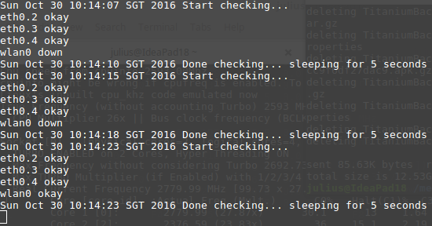

**Figure 8.2** The output of the script when run

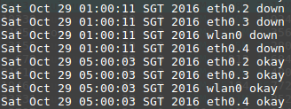

**Figure 8.3** The log of the script. Pictured here is the shutdown of internet connection every day from 1am to 5am

### 9. Fifth Improvement: Maximising utilisation of the higher bandwidth

The next thing I did was to adapt the various scripts I had on my computer to fully utilise the new configuration by making them more parallelised in terms of downloading and uploading data. I backup my data to rsync.net using rsync. Instead of using simple rsync, I created a script to parallelise the syncing process and hence use the whole available bandwidth. The script and output is in Figures 9.1 to 9.2. For package management, I use the apt-fast package which utilises multiple connections. I also adapted a script I used to download using multiple connections through aria2, as shown in Figure 9.3. In this case, I do not worry about overloading the server because my maximum internet bandwidth is only 1 MB/s which can be easily fulfilled by most servers.

```bash
#!/bin/bash
#
#uploadz500 v1.1.20160830
#(c)2016, Julius Putra Tanu Setiaji
#parallel rsync to rsync.net
if [[ "$1" == "" ]]; then
thread=6
else
thread=$1
fi
set -e
set -o pipefail
echo -e "\e[1m\e[92m$(date) Starting job with $thread threads\e[0m"
output="$(rsync -avzhy --delete-delay --dry-run Z500 1082@usw-s001.rsync.net:Lenovo|egrep -v '/$'|egrep -v '.*ing.*'|head -n -3|sort -V)"
while [[ ! $(echo "$output") == "" ]]; do
echo -e "\e[1m\e[92m$(date) There are $(echo "$output"|wc -l) files to be uploaded\e[0m"
echo "$output"|parallel -j $thread 'rsync {} 1082@usw-s001.rsync.net:Lenovo/ -PavzhRy --delete-delay;echo -e "\e[1m\e[92m$(date) End of this file\e[0m"'
output="$(rsync -avzhy --delete-delay --dry-run Z500 1082@usw-s001.rsync.net:Lenovo|egrep -v '/$'|egrep -v '.*ing.*'|head -n -3|sort -V)"
done
rsync Z500 1082@usw-s001.rsync.net:Lenovo/ -PavzhRy --delete-delay
```

**Figure 9.1** The adapted rsync script – The directories synchronised is “Z500” in the local computer and “Lenovo” on the remote server.

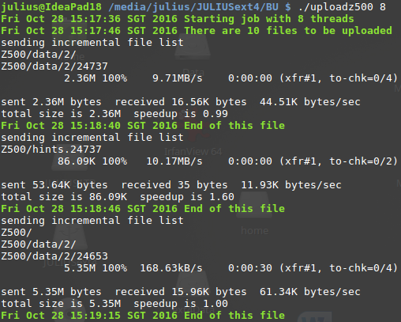

**Figure 9.2** A sample output of this script

```bash
#!/bin/bash
# dl.sh v1.0.20160328
if [ "$1" == "-1" ]; then
aria2c $2 -s12 --auto-file-renaming=false -iurl.txt -x12 -k1M
fi
while [ "$(ls|grep aria2)" ]; do
while [ "$(ps -A|grep aria2c )" ]; do
echo Another instance of aria2c is still running
echo Press Ctrl-C to abort now
sleep 1
done
while [ "$(ps -A|grep aptitude)" ]; do
echo An instance of aptitude is running
echo Press Ctrl-C to abort now
sleep 1
done
while [ "$(ps -A|grep apt-get)" ]; do
echo An instance of apt-get is running
echo Press Ctrl-C to abort now
sleep 1
done
while [ "$(ps -A|grep rsync)" ]; do
echo An instance of rsync is running
echo Press Ctrl-C to abort now
sleep 1
done
aria2c $2 -s12 --auto-file-renaming=false -iurl.txt -x12 -k1M
echo Press Ctrl-C to abort now
sleep 1
done
echo All files has finished downloading.
```

**Figure 9.3** The download script I wrote. Use “-1” switch when initiating a new download. It will only resume downloads when no instance of other download is running. It will automatically resume if the download is interrupted. It uses aria2 to download using multiple connections (12 connections are instead of 4 because it is possible that some connections are routed to the same Wi-Fi receiver due to the presence of other traffics)

Before (Fourth Improvement)|After (Fifth Improvement)
---|---
Reliable internet when used by multiple devices (tested with 7 devices)|Reliable internet when used by multiple devices (tested with 7 devices)
Maximum speed of 1024 KB/s|Maximum speed of 1024 KB/s
Even under heavy bandwidth load, latency is maintained between 100-200 ms, and package loss is below 5%|Even under heavy bandwidth load, latency is maintained between 100-200 ms, and package loss is below 5%
Shell script constantly monitoring whether any interface is down|Shell script constantly monitoring whether any interface is down
Most software on my computer used only a single connection, thus speed is capped at 256 KB/s|Software is adapted to use multiple connections, and thus is able to utilise the full 1024 KB/s

### 10. Summary and Final Notes

Initial Solution|First Improvement|Fifth Improvement
---|---|---
Unusable internet – more than 90% package loss|Reliable internet when used for light internet browsing or bandwidth-intensive services by 1 device only.Reliable internet when used by multiple devices (tested with 7 devices)
Maximum speed of 256 KB/s (but practical speed of under 16 KB/s due to high SNR)|Maximum speed of 256 KB/s|Maximum speed of 1024 KB/s
Not Applicable|Under heavy bandwidth load, latency worsens to 2000 ms and package loss of up to 60%|Even under heavy bandwidth load, latency is maintained between 100-200 ms, and package loss is below 5%
Not Applicable|No way of quickly checking whether any interface is down|Shell script constantly monitoring whether any interface is down
Not Applicable|Most software on my computer used only a single connection, thus speed is capped at 256 KB/s|Software is adapted to use multiple connections, and thus is able to utilise the full 1024 KB/s
Not Applicable|The improvements are incremental but by comparing the initial solution, the first improvement and the final improvement, we can see that the system has come a long way.|The first 3 improvements were done on both hardware and software side, while the fourth and fifth improvements were done solely on the software side for convenience and to fully utilise the hardware.

Fun fact: I configured my routers to use their LEDs to flash “JULIUS” in Morse code, which you can see in the videos attached. (JULIUS in Morse Code is .---/..-/.-../../..-/...)